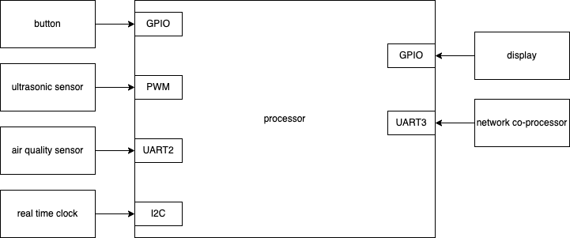
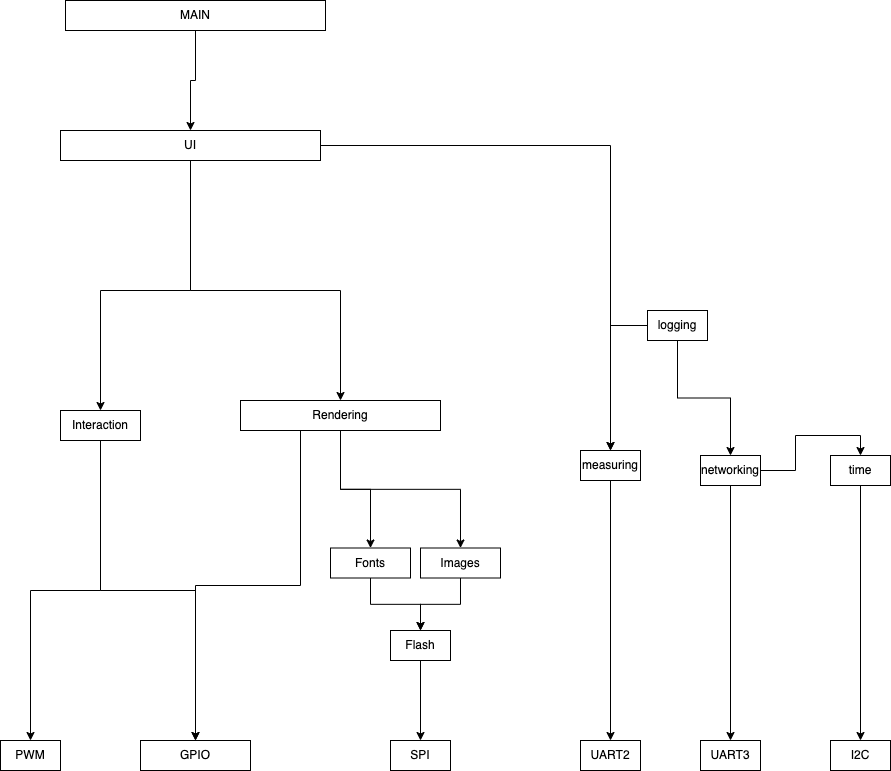
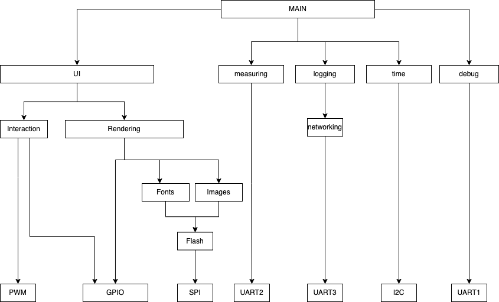
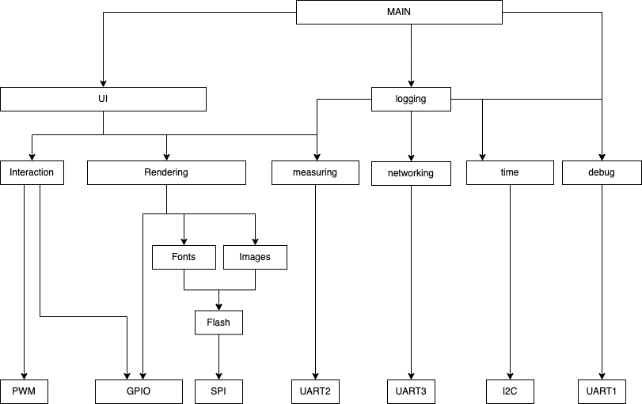
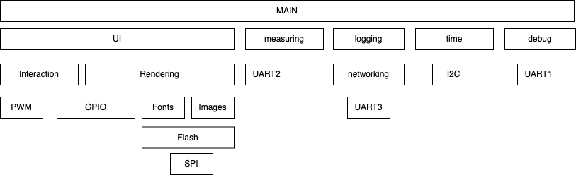

# Week 1 - Exercise 1: Idea project diagram

## Summary

The system measures the air quality in a room and displaying the readings to a user if they are standing in front of the system. The user can page through different air quality measurements and if they move away the display switches off. The air quality readings are transmitted to a server so they can be logged.

The air quality measures are temperature, humidity, particulate matter (PM2.5 and PM10), eCO2, formaldehyde, volatile organice compounds (TVOC). The presence of the user is detected with an ultrasound sensor. The user can page through the air quality measurements with the onboard button.

The connection to the server is handled by a networking co-processor (regarded as a black box in this assignement).

- **Option 1:** Particle Xenon using CoAP over OpenThread
- **Option 2:** ESP32 using MQTT over Wifi

## Block Diagram

## Hierachy of Control Diagram

### v0

### v2

I reordered the hierarchy to have it flatter and therefore more versatile for the future.

Note: If I would introduce OTA update, networking would need to be lifted up higher as well.

### v3 dependencies

To show the dependencies between subsystem, this view is more correct.

## Layered Software Architecture Diagram

## Parts list

| Function                   | Name                    | Interface type | Link                                                                                                                                                                                       |
| -------------------------- | ----------------------- | -------------- | ------------------------------------------------------------------------------------------------------------------------------------------------------------------------------------------ |
| 7-in-1 Air Quality Sensor  | SM300D2                 | UART           | https://www.banggood.com/SM300D2-7-in-1-PM2_5-+-PM10-+-Temperature-+-Humidity-+-CO2-+-eCO2-+-TVOC-Sensor-Tester-Detector-Module-for-Air-Quality-Monitoring-p-1681079.html?cur_warehouse=CN |
| Base board                 | STM32F429I-DISC1        | -              | https://www.st.com/en/evaluation-tools/32f429idiscovery.html                                                                                                                               |
| Realtime Clock             | Onboard                 |                |                                                                                                                                                                                            |
| Ultrasonic distance sensor | Grove Ultrasonic Ranger | PWM            | https://wiki.seeedstudio.com/Grove-Ultrasonic_Ranger/                                                                                                                                      |
| Button                     | Onboard                 | GPIO           |                                                                                                                                                                                            |
| LCD                        | Onboard                 | GPIO           |

### Network Co-Processor Option 1: Particle Xenon using CoAP over OpenThread

| Function                        | Name           | Interface type | Link                            |
| ------------------------------- | -------------- | -------------- | ------------------------------- |
| Network Co-Processor OpenThread | Particle Xenon | UART           | https://docs.particle.io/xenon/ |

### Network Co-Processor Option 2: ESP32 using MQTT over Wifi

| Function                  | Name               | Interface type | Link                                  |
| ------------------------- | ------------------ | -------------- | ------------------------------------- |
| Network Co-Processor Wifi | Adafruit Huzzah 32 | UART           | https://www.adafruit.com/product/3405 |
