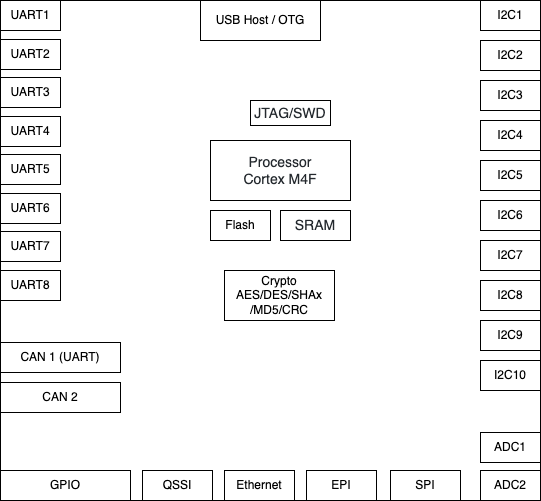

# Week 2 - Exercise 2: Investigate Project Boards

## Tasks

For each board, look at the datasheet and getting started information for the board. Draw the hardware block diagram for the board. For peripherals, note the communication paths (SPI, I2C, etc).

Look through the datasheet for the processor and other documents. Answer these questions:

- What kind of processor is it?
- How much Flash and RAM does it have? Any other memory types?
- Does it have any special peripherals? (List 3-5 that you find interesting.)
- If it has an ADC, what are the features?
- How much does the board cost vs what the processor costs? Is the processor in stock anywhere? (Try Digikey, Mouser, Octopart, Google, and so on.)

Look at one application note for this board.

## Task 1: Investigate the board intended for your final project

Source [^1]

| Function             |                                                    |
| -------------------- | -------------------------------------------------- |
| Processor            | STM32F429ZIT6, Arm Cortex-M4 core with DSP and FPU |
| Flash                | 2 Mbytes                                           |
| RAM                  | 256 Kbytes                                         |
| Other Memory         | 64-Mbit SDRAM                                      |
| Special Peripheral 1 | 3-axis digital output gyroscope                    |
| Special Peripheral 2 | Six LEDs                                           |
| Special Peripheral 3 | 2.4" QVGA TFT LCD                                  |
| Special Peripheral 4 | Camera Interface                                   |
| Special Peripheral 5 | Random generator                                   |
| ADC                  | 3                                                  |
| ADC features         | 24 channels                                        |
| Board cost           | 29 USD, 42 USD USD                                 |
| Processor cost       | 20-25 USD                                          |
| Stock                | Mouser: 29, Digikey: 19, Newark: 185 (42 USD)      |

---

**Further Notes:**

## Task 2: Investigate the board assigned to you: LEDMCUEVM-132

| Function             |                                                          |
| -------------------- | -------------------------------------------------------- |
| Processor            | MSP432E401Y, 120 Mhz Arm Cortex M4F with FPU             |
| Flash                | 1024KB                                                   |
| RAM                  | 256KB SRAM                                               |
| Other Memory         | EEPROM: 6KB, Internal ROM, External Peripheral Interface |
| Special Peripheral 1 | 10/100 Ethernet                                          |
| Special Peripheral 2 | USB 2.0 OTG                                              |
| Special Peripheral 3 | 8 UARTs                                                  |
| Special Peripheral 4 | QSSI, 2 CAN                                              |
| Special Peripheral 5 | 10 I2C, 4 PWM                                            |
| ADC                  | yes                                                      |
| ADC features         | 2 12-bit ADC, 2Msps, three comparator                    |
| Board cost           | Digikey: 131,67 USD, Mouser: 118,80 USD                  |
| Processor cost       | 17-23 USD                                                |
| Stock                | Digikey: 5, Mouser: 3, TI: 0                             |

---

**Further Notes:**

- SPI for up to 6 devices
- UART for LMM family devices
- CAN transceiver for UART for LMM family devices
- 4 pwm for dimming
- multiple GPIOs
- 5v power
- digital isolaters for all MSP432 signals
- standard CAN bus with a transceiver

---

[^1]: Source: https://www.st.com/resource/en/user_manual/um1670-discovery-kit-with-stm32f429zi-mcu-stmicroelectronics.pdf
